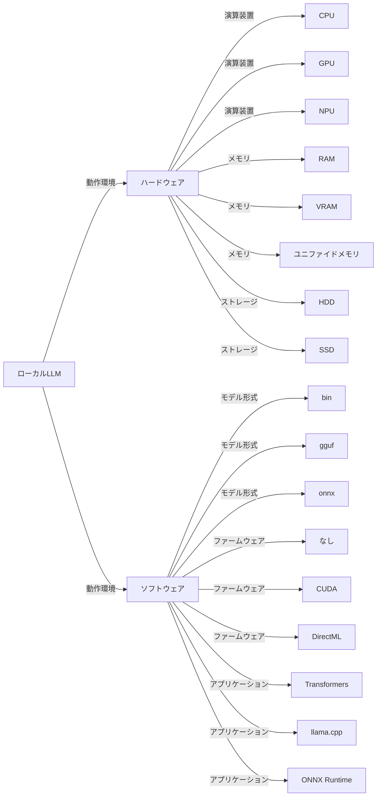
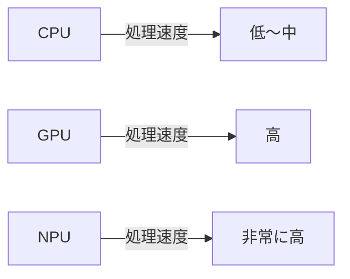
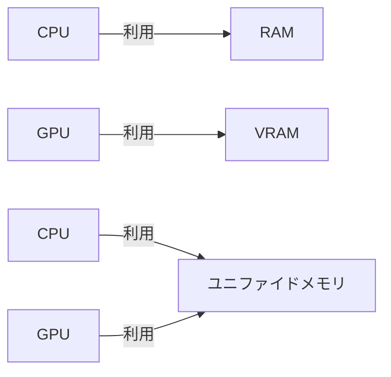
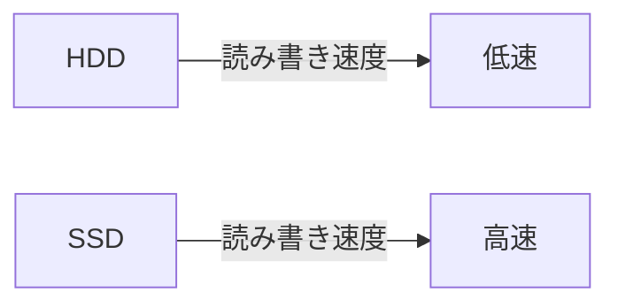
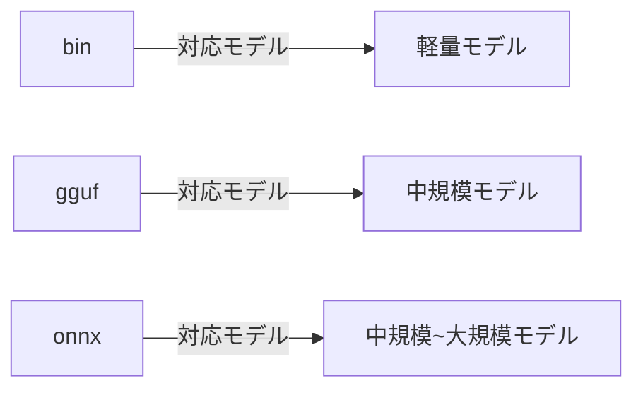
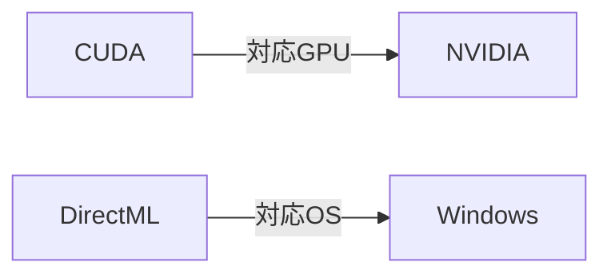
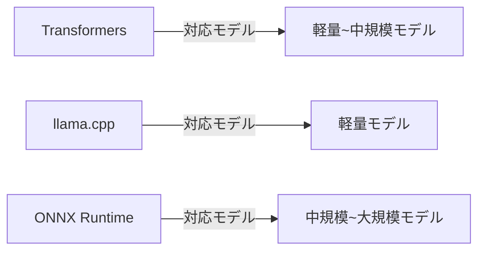
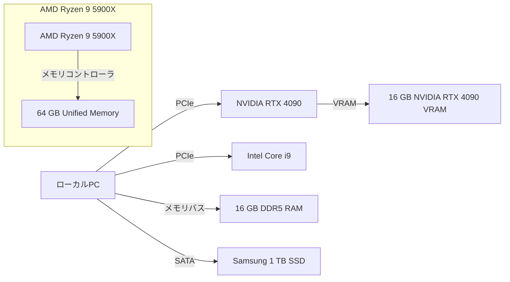
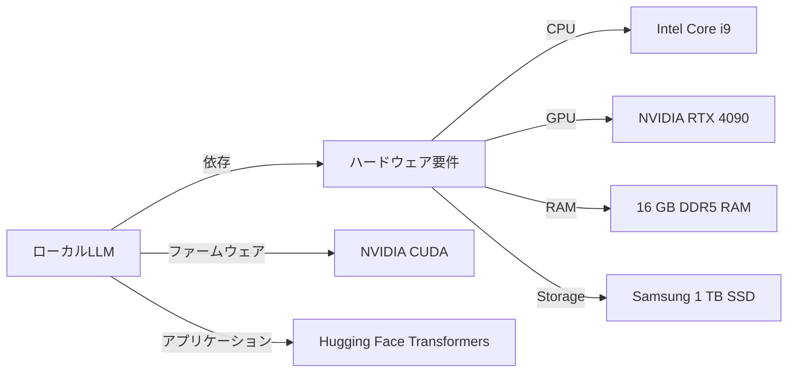
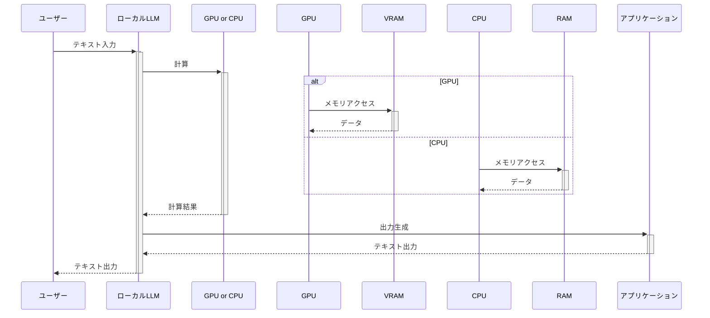

# doc_genai_About_the_local_LLM_operating_environment
ローカルLLMの動作環境について

  
## 目次

- [ローカルLLMの動作環境](#ローカルllmの動作環境)
- [1. ローカルLLM動作環境要素比較表](#1-ローカルllm動作環境要素比較表)
- [2. 要素解説](#2-要素解説)
    - [2.1. 演算装置](#21-演算装置)
    - [2.2. メモリ](#22-メモリ)
    - [2.3. ストレージ](#23-ストレージ)
    - [2.4. モデル形式](#24-モデル形式)
    - [2.5. ファームウェア](#25-ファームウェア)
    - [2.6. アプリケーション](#26-アプリケーション)
- [3. 図表による解説](#3-図表による解説)
    - [3.1. 構成図](#31-構成図)
    - [3.2. 関係図](#32-関係図)
    - [3.3. フロー図](#33-フロー図)
- [4. まとめ](#4-まとめ)

  
## ローカルLLMの動作環境

近年注目を集める大規模言語モデル (LLM) は、ローカル環境でも動作させることが可能です。
最適なハードウェアとソフトウェアを選択することが、ローカルLLMの性能を最大限に引き出す鍵となります。

この資料では、ローカルLLM動作環境の主要な要素について、表形式と説明文で解説し、理解を深めるための構成図、関係図、フロー図の提案を行います。

  
### 1. ローカルLLM動作環境要素比較表

| 項目 | 種類 | 特徴 | パフォーマンスへの影響 | 対応モデル | 備考 |
|---|---|---|---|---|---|
| **演算装置** | CPU | 汎用性が高い、入手しやすい | 低〜中 | 軽量モデル | 消費電力低 |
| | GPU | 並列処理に優れる | 高 | 中規模モデル | 高速処理 |
| | NPU | AI処理に特化 | 非常に高 | 中規模～大規模モデル | 最新モデルに対応 | 高価 |
| **メモリ** | RAM | システムメモリ、高速アクセス | 中 | モデルと中間結果 | 容量不足は処理速度低下 |
| | VRAM | GPU搭載メモリ、高速アクセス | 高（GPU使用時） | モデルと中間結果 | 容量不足は処理速度低下 |
| | ユニファイドメモリ | CPU/GPU共有 | 高（適切な設計時） | 最新モデル | 省電力 | 対応機種が限られる |
| **ストレージ** | HDD | 大容量、低価格 | 低 | モデルの保存 | 読み込み速度が処理速度に影響 |
| | SSD | 高速 | 中～高 | モデルの保存 | 読み込み速度が処理速度向上に貢献 | 高価格 |
| **モデル形式** | bin | 軽量で汎用性が高い | 中 | 軽量モデル | 推論速度が速い | シンプルな構造 |
| | gguf | 圧縮形式 | 高 | 中規模モデル | 推論速度と圧縮率のバランス | Google AI モデル向け |
| | onnx | 相互運用性が高い | 中～高 | 中規模～大規模モデル | 汎用性が高い | モデル変換が必要 |
| **ファームウェア** | なし | 汎用性が高い | 低 | 軽量モデル | 設定が複雑 |
| | CUDA | NVIDIA GPU向け | 高（NVIDIA GPU使用時） | 中規模～大規模モデル | 高速処理 | NVIDIA製GPU必須 | 設定が複雑 |
| | DirectML | Windows向け | 中～高（Windows環境） | 中規模～大規模モデル | 高速処理 | Microsoft製GPU必須 | 設定が複雑 |
| **アプリケーション** | Transformers | 柔軟性が高い | 中 | 軽量～中規模モデル | 使いやすい | Python向け |
| | llama.cpp | 最適化された実装 | 高 | 軽量モデル | 高速処理 | 軽量モデル向け | C++ スキルが必要 |
| | ONNX Runtime | 相互運用性が高い | 中～高 | 中規模～大規模モデル | 高速処理 | ONNX形式モデル | 設定が複雑 |

  
### 2. 要素解説

#### 2.1. 演算装置

- **CPU**: 汎用性が高く、一般的なパソコンに搭載されているため入手しやすいですが、LLMに必要な並列処理能力は低いため、軽量モデルの処理に適しています。
- **GPU**: グラフィックボードに搭載され、CPUよりも高速な並列処理が可能です。中規模モデルの処理に適しています。
- **NPU**: ニューラルネットワーク処理に特化したチップで、GPUよりも高速かつ省電力です。中規模から大規模モデルの処理に適しており、最新モデルへの対応も期待できますが、高価です。

  
#### 2.2. メモリ

- **RAM**: システムメモリであり、データの読み書き速度が速いです。モデルと中間結果を格納します。容量不足は処理速度の低下に繋がります。
- **VRAM**: GPUに搭載されたメモリで、RAMよりも高速な読み書き速度が可能です。GPU使用時にモデルと中間結果を格納します。容量不足は処理速度の低下に繋がります。
- **ユニファイドメモリ**: CPUとGPUが共有できるメモリで、両方の利点を活かせます。最新モデルの処理に適していますが、対応機種が限られます。

  
#### 2.3. ストレージ

- **HDD**: 大容量ですが、データの読み書き速度が遅いため、処理速度に影響を与える可能性があります。モデルの保存などに用いられます。
- **SSD**: HDDよりも高速なデータ読み書きが可能です。モデルの保存に用いることで処理速度の向上に貢献します。

  
#### 2.4. モデル形式

- **bin**: 軽量で汎用性が高く、軽量モデルの保存に適しています。推論速度が速いという特徴があります。
- **gguf**: Googleが開発した圧縮形式で、中規模モデルの保存に適しています。推論速度と圧縮率のバランスが取れています。
- **onnx**: オープンフォーマットであり、中規模から大規模モデルの保存に適しています。汎用性が高く様々なフレームワークに対応しているため、環境間でのモデルの移植が容易です。

  
#### 2.5. ファームウェア

- **なし**: モデルを直接実行します。軽量モデルにのみ適用可能です。
- **CUDA**: NVIDIA GPU向けに最適化されており、高速処理が可能です。
- **DirectML**: Windows環境向けに最適化されており、高速処理が可能です。

  
#### 2.6. アプリケーション

- **Transformers**: Hugging Faceが提供するライブラリで、軽量から中規模モデルの処理に適しています。Python向けに設計されており、使いやすいインターフェースを備えています。
- **llama.cpp**: C++で実装された軽量ライブラリで、軽量モデルの高速処理に特化しています。
- **ONNX Runtime**: ONNXモデル専用の実行環境です。中規模から大規模モデルの高速処理と汎用性を兼ね備えています。

  
### 3. 図表による解説

* ◆◆◆注意事項◆◆◆  **以下の図表による解説は、特定の製品名を含んでいますが、これらはあくまでイメージしやすいようにサンプルとして表記したものであり、実際に動作する環境とは無関係です。したがって、これらの情報を元に実際の環境を構築する際の参考にすることは推奨されません。具体的な環境構築については、各製品の公式ドキュメンテーションや専門家のアドバイスを参照してください。**

#### 3.1. 構成図

#### 3.2. 関係図

#### 3.3. フロー図

  
### 4. まとめ

ローカルLLMの動作環境は、目的や予算、利用可能な資源に応じて最適な構成を選択することが重要です。
本資料が、読者のローカルLLM環境構築の一助となれば幸いです。

  

